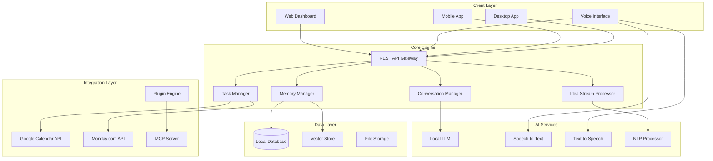

# Aether AI Companion - Design Document

## Overview

Aether is designed as a distributed, privacy-first AI companion system with a microservices architecture that prioritizes local data storage, cross-platform compatibility, and extensible functionality. The system consists of a core engine, multiple client applications, and a plugin ecosystem that enables seamless integration with business tools while maintaining user privacy and control.

## Architecture

### High-Level Architecture



### Core Components

#### 1. API Gateway
- **Purpose**: Central entry point for all client requests
- **Technology**: Node.js with Express or Python FastAPI
- **Responsibilities**:
  - Request routing and load balancing
  - Authentication and authorization
  - Rate limiting and request validation
  - WebSocket connections for real-time updates

#### 2. Conversation Manager
- **Purpose**: Orchestrates AI conversations and context management
- **Technology**: Python with LangChain or similar framework
- **Responsibilities**:
  - Natural language processing coordination
  - Context window management
  - Conversation flow control
  - Response generation and formatting

#### 3. Memory Manager
- **Purpose**: Handles long-term memory storage and retrieval
- **Technology**: Python with vector database integration
- **Responsibilities**:
  - Semantic memory indexing and storage
  - Context-aware information retrieval
  - Memory consolidation and optimization
  - User-controlled memory management

#### 4. Task Manager
- **Purpose**: Manages task identification, prioritization, and external integrations
- **Technology**: Python with async processing
- **Responsibilities**:
  - Task extraction from conversations
  - Priority scoring and scheduling
  - External API synchronization
  - Deadline and reminder management

#### 5. Idea Stream Processor
- **Purpose**: Handles rapid idea capture and intelligent processing
- **Technology**: Python with real-time processing capabilities
- **Responsibilities**:
  - Instant idea ingestion and categorization
  - Automatic metadata generation
  - Connection identification and suggestion
  - Conversion to actionable items

## Components and Interfaces

### Client Applications

#### Desktop Application
- **Framework**: Electron or Tauri for cross-platform compatibility
- **Features**:
  - Always-accessible system tray integration
  - Quick capture overlay (global hotkey)
  - Full dashboard interface
  - Offline capability with sync
- **Interface**: REST API + WebSocket for real-time updates

#### Mobile Applications
- **Framework**: React Native or Flutter for cross-platform development
- **Features**:
  - Voice and text input optimization
  - Background idea capture
  - Push notifications for reminders
  - Offline-first architecture
- **Interface**: REST API with local caching

#### Voice Interface
- **Technology**: Open-source STT/TTS solutions (Whisper, Coqui TTS)
- **Features**:
  - Continuous listening mode
  - Voice activity detection
  - Multiple voice personality options
  - Phone integration (stretch goal)

### Data Storage Architecture

#### Local Database
- **Technology**: SQLite for local storage, PostgreSQL for advanced features
- **Schema Design**:
  ```sql
  -- Conversations table
  CREATE TABLE conversations (
      id UUID PRIMARY KEY,
      timestamp TIMESTAMP,
      user_input TEXT,
      ai_response TEXT,
      context_metadata JSONB,
      session_id UUID
  );
  
  -- Ideas table
  CREATE TABLE ideas (
      id UUID PRIMARY KEY,
      content TEXT,
      timestamp TIMESTAMP,
      source VARCHAR(50), -- 'desktop', 'mobile', 'voice'
      processed BOOLEAN DEFAULT FALSE,
      metadata JSONB
  );
  
  -- Tasks table
  CREATE TABLE tasks (
      id UUID PRIMARY KEY,
      title TEXT,
      description TEXT,
      priority INTEGER,
      due_date TIMESTAMP,
      status VARCHAR(20),
      source_idea_id UUID,
      external_ids JSONB -- Google Calendar, Monday.com IDs
  );
  ```

#### Vector Store
- **Technology**: ChromaDB or Qdrant for semantic search
- **Purpose**: Store embeddings for conversations, ideas, and documents
- **Features**:
  - Semantic similarity search
  - Contextual memory retrieval
  - Cross-reference identification

### External Integrations

#### Google Calendar Integration
- **API**: Google Calendar API v3
- **Authentication**: OAuth 2.0 with refresh tokens
- **Capabilities**:
  - Two-way event synchronization
  - Conflict detection and resolution
  - Automated event creation from conversations
  - Smart scheduling suggestions

#### Monday.com Integration
- **API**: Monday.com GraphQL API
- **Authentication**: API tokens with workspace permissions
- **Capabilities**:
  - Board and item management
  - Status updates and assignments
  - Progress tracking and reporting
  - Automation trigger integration

## Data Models

### Core Data Models

#### Conversation Model
```python
@dataclass
class Conversation:
    id: UUID
    timestamp: datetime
    user_input: str
    ai_response: str
    context_metadata: Dict[str, Any]
    session_id: UUID
    memory_references: List[UUID]
    extracted_tasks: List[UUID]
```

#### Memory Entry Model
```python
@dataclass
class MemoryEntry:
    id: UUID
    content: str
    embedding: List[float]
    timestamp: datetime
    importance_score: float
    tags: List[str]
    connections: List[UUID]
    user_editable: bool
```

#### Idea Model
```python
@dataclass
class Idea:
    id: UUID
    content: str
    timestamp: datetime
    source: str  # 'desktop', 'mobile', 'voice'
    processed: bool
    category: Optional[str]
    priority_score: float
    connections: List[UUID]
    converted_to_task: Optional[UUID]
```

#### Task Model
```python
@dataclass
class Task:
    id: UUID
    title: str
    description: str
    priority: int
    due_date: Optional[datetime]
    status: TaskStatus
    source_idea_id: Optional[UUID]
    external_integrations: Dict[str, str]
    dependencies: List[UUID]
```

## Error Handling

### Error Categories and Strategies

#### 1. Network and API Errors
- **Strategy**: Exponential backoff with circuit breaker pattern
- **Implementation**: Retry failed requests with increasing delays
- **Fallback**: Queue operations for later sync when connectivity restored

#### 2. AI Model Errors
- **Strategy**: Graceful degradation with fallback responses
- **Implementation**: Multiple model tiers (local → cloud → cached responses)
- **Monitoring**: Track model performance and switch automatically

#### 3. Data Consistency Errors
- **Strategy**: Event sourcing with conflict resolution
- **Implementation**: Maintain event log for all data changes
- **Recovery**: Replay events to restore consistent state

#### 4. External Integration Failures
- **Strategy**: Isolated failure handling per integration
- **Implementation**: Service-specific error handling and retry logic
- **User Experience**: Clear status indicators and manual retry options

### Error Recovery Mechanisms

```python
class ErrorRecoveryManager:
    def handle_api_error(self, error: APIError, context: RequestContext):
        if error.is_retryable():
            return self.schedule_retry(error, context)
        else:
            return self.fallback_response(error, context)
    
    def handle_data_conflict(self, conflict: DataConflict):
        return self.merge_strategy.resolve(conflict)
    
    def handle_integration_failure(self, service: str, error: IntegrationError):
        self.circuit_breakers[service].record_failure()
        return self.queue_for_later_sync(error.operation)
```

## Testing Strategy

### Testing Pyramid

#### Unit Tests (70%)
- **Scope**: Individual components and functions
- **Framework**: pytest for Python, Jest for JavaScript
- **Coverage**: All business logic, data models, and utility functions
- **Mocking**: External APIs and AI models

#### Integration Tests (20%)
- **Scope**: Component interactions and API endpoints
- **Framework**: pytest with test containers
- **Coverage**: Database operations, API integrations, cross-component workflows
- **Environment**: Isolated test databases and mock external services

#### End-to-End Tests (10%)
- **Scope**: Complete user workflows across all platforms
- **Framework**: Playwright for web, Appium for mobile
- **Coverage**: Critical user journeys and cross-platform synchronization
- **Environment**: Staging environment with real integrations

### Specialized Testing

#### AI Model Testing
- **Approach**: Golden dataset testing with human evaluation
- **Metrics**: Response quality, context retention, task extraction accuracy
- **Automation**: Regression testing for model updates

#### Performance Testing
- **Load Testing**: Concurrent user simulation
- **Memory Testing**: Long-term memory growth and retrieval performance
- **Mobile Testing**: Battery usage and offline capability

#### Security Testing
- **Data Privacy**: Encryption verification and data leak prevention
- **API Security**: Authentication, authorization, and input validation
- **Integration Security**: OAuth flow testing and token management

### Continuous Testing Pipeline

```yaml
# Example CI/CD pipeline
stages:
  - unit_tests:
      parallel: true
      coverage_threshold: 80%
  - integration_tests:
      services: [postgres, redis]
      timeout: 30m
  - security_scan:
      tools: [bandit, safety, semgrep]
  - performance_tests:
      condition: main_branch
      timeout: 60m
  - e2e_tests:
      condition: release_candidate
      timeout: 90m
```

This design provides a robust, scalable foundation for Aether that prioritizes user privacy, cross-platform compatibility, and extensible functionality while maintaining the intelligent, proactive capabilities you've envisioned for your business management needs.